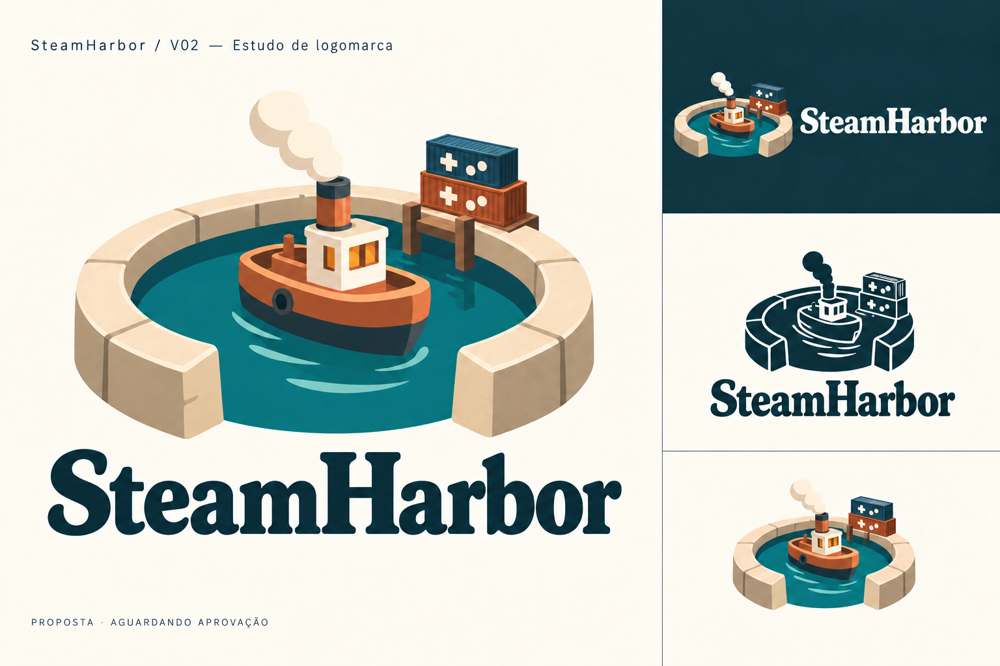

# SteamHarbor — Estratégia de branding

**Edição 1.0 · 9 de setembro de 2026 · Documento oficial de estratégia**  
Responsável pela decisão de marca: proprietário do projeto. Fonte visual definitiva: [prancha aprovada v02](approved/v02/steamharbor-v02-approved-board.png). Governança: [ADR-0006](../decisions/ADR-0006-definitive-harbor-brand.md).

## 1. Síntese executiva

SteamHarbor é uma plataforma independente para descobrir e compreender jogos da Steam. Organiza atividade, avaliações, preços e histórico em caminhos claros para decidir o que jogar, comprar ou acompanhar. Sua identidade é um **porto de descobertas**: acolhedor para quem chega, útil para quem explora e confiável para quem volta.

A marca combina o calor de um universo de jogos com a precisão de uma ferramenta de dados. O porto ilustrado cria reconhecimento e afinidade; a experiência conquista confiança ao explicar fontes, períodos e limites. A promessa não depende de volume de informação, de urgência promocional ou de uma estética técnica intimidante.

Este documento consolida a estratégia solicitada após a aprovação final da logo. O desenho foi aprovado explicitamente; a formulação estratégica abaixo é a tradução profissional dessa direção, não uma citação de aprovação individual de cada frase. Regras operacionais e recomendações técnicas estão discriminadas no guia.

## 2. Propósito, visão e promessa

**Propósito:** ajudar pessoas a fazer escolhas mais informadas sobre jogos, com menos esforço para interpretar dados.

**Visão:** tornar SteamHarbor um ponto de referência acessível para explorar o que acontece nos jogos da Steam, da consulta rápida à investigação detalhada.

**Promessa de marca:** oferecer contexto claro para a próxima escolha do jogador. É uma promessa de experiência, não garantia de economia, qualidade de um jogo ou previsão de sucesso.

**Posicionamento:** para jogadores que querem descobrir opções e entender o cenário antes de decidir, SteamHarbor é um guia independente de dados de jogos que aproxima descoberta e evidência em uma experiência acolhedora e progressivamente aprofundável.

Não há slogan oficial aprovado. “Porto de descobertas” nomeia o território criativo; não deve ser acrescentado automaticamente à assinatura.

## 3. Públicos e situações de uso

| Público | Necessidade | Resposta da marca |
|---|---|---|
| Jogador casual | Descobrir e saber se um jogo está ativo | Linguagem simples, resposta principal visível e acesso rápido à busca |
| Jogador atento ao preço | Entender uma oferta no contexto disponível | Região, moeda, período observado e ausência de pressão comercial |
| Entusiasta e pesquisador | Comparar mudanças e investigar tendências | Definições, filtros, histórico e rastreabilidade |
| Criador, jornalista e desenvolvedor | Sustentar uma leitura com evidências | Fonte, atualização, cobertura e metodologia identificáveis |

São modos de uso, não categorias fixas de pessoas. A mesma pessoa pode querer uma resposta curta hoje e dados detalhados amanhã.

## 4. Pilares e provas

| Pilar | Comportamento esperado | Evidência de entrega |
|---|---|---|
| Clareza | Responder antes de aprofundar | Métrica compreensível, período explícito, próximo passo evidente |
| Confiança | Informar limites com a mesma clareza dos resultados | Fonte, horário, cobertura e natureza do dado |
| Descoberta | Mostrar caminhos úteis sem impor uma escolha | Motivo factual para um destaque e acesso ao jogo |
| Afinidade com jogos | Acolher sem infantilizar ou exigir repertório gamer | Identidade própria, textos humanos e reconhecimento do contexto de jogo |
| Autonomia | Permitir exploração e comparação | Profundidade disponível, controles previsíveis, ausência de falsa urgência |

As provas são critérios para implementação e avaliação, não afirmações de que o produto atual já as cumpre integralmente. Hoje a aplicação continua baseada em fixtures; preços, históricos e integrações não passam a existir por causa da marca.

## 5. Significado da identidade definitiva

| Elemento | Papel na narrativa |
|---|---|
| Cais aberto e bacia abrigada | Um lugar de chegada, organização e partida para novas descobertas |
| Barco a vapor | Associação verbal a Steam e movimento de exploração; não representa a empresa Valve |
| Contêineres com direcionais e botões | Conexão explícita entre porto, conteúdo e jogos |
| Água verde-petróleo | Continuidade e tranquilidade, sustentando a atmosfera do porto |
| Cobre, terracota e marfim | Calor e materialidade que aproximam a marca de um universo de jogos |
| Nome com serifas robustas | Personalidade acolhedora e presença editorial |

O conjunto é um emblema ilustrado com volume. Não deve ser reduzido por outro agente a um símbolo genérico de âncora, controle ou farol. O conceito detalhado de porto permanece referência para ilustrações futuras; a casa presente nessa referência não substitui os contêineres da logo definitiva.

## 6. Personalidade

SteamHarbor age como um anfitrião informado: recebe bem, explica com precisão e deixa o jogador decidir. É curioso sem ser invasivo; seguro sem parecer infalível; expressivo sem competir com o conteúdo.

| Atributo | Expressão adequada | Desvio a evitar |
|---|---|---|
| Acolhedor | Orientar com frases curtas e úteis | Infantilização, diminutivos constantes, mascote excessivo |
| Preciso | Definir o que o número mede | Jargão, voz burocrática, falsa exatidão |
| Curioso | Convidar a explorar mudanças | Clickbait e causas inventadas |
| Gamer | Usar referências reconhecíveis com moderação | Gírias obrigatórias e estética agressiva de esports |
| Independente | Identidade e atribuição claras | Aparência oficial de Steam ou Valve |

## 7. Diferenciação e contexto competitivo

A pesquisa inicial observou abrangência de informação no [SteamDB](https://steamdb.info/), organização pessoal e social no [Backloggd](https://backloggd.com/about/) e acompanhamento de preços no [Deku Deals](https://www.dekudeals.com/). O objetivo não é afirmar que essas marcas carecem de clareza: SteamHarbor escolhe enfatizar compreensão para decidir, com uma identidade de porto própria. Fontes e limites estão em [research.md](research.md).

Não há pesquisa de anterioridade, registro ou exclusividade jurídica concluída. O nome e domínio foram definidos pelo proprietário; a aprovação visual não comprova disponibilidade de marca ou licenças de terceiros.

## 8. Arquitetura verbal e editorial

Nome oficial: **SteamHarbor**. Domínio: **steamharbor.com**. Preservar capitalização e grafia, sem espaço entre palavras. Nome de produto não é “Steam Harbor”, “SteamHarbour” ou “SH”. O monograma inicial SH não é a assinatura oficial.

Categorias funcionais devem continuar reconhecíveis: busca, jogos, atividade, avaliações, preços, lançamentos e atualizações. Metáforas de porto pertencem a peças de marca e momentos editoriais; não renomear busca para “bússola”, favoritos para “carga” ou erros para “naufrágio”.

Descritor institucional: “Plataforma independente para descobrir e compreender jogos da Steam.” Em inglês: “An independent platform for discovering and understanding Steam games.” Não implica integração disponível ou vínculo oficial.

A interface atual é em inglês. O guia apresenta exemplos em inglês e português para consistência futura, sem autorizar mudança de idioma nesta tarefa.

## 9. Experiência de marca e tema futuro

A ilustração rica e a área de dados desempenham papéis diferentes. A identidade oferece atmosfera em assinatura, apresentação institucional e peças editoriais. Busca, tabelas, gráficos e formulários priorizam superfícies tranquilas, contraste e desempenho.

O tema deve transportar cores, qualidade de acabamento e acolhimento do porto. Não deve transformar toda a aplicação em cenário 3D, acrescentar textura sob números ou simular madeira e pedra nos controles. Dados de jogos reais continuam sendo o conteúdo principal.

## 10. Critérios de sucesso

Nas revisões futuras, verificar: reconhecimento do nome e do porto; associação com jogos; ausência de percepção de afiliação oficial; leitura confortável de números; entendimento de fonte e indisponibilidade; utilidade em celular e teclado. Usar tarefas reais de busca e interpretação. Registrar resultados observados, sem declarar sucesso apenas por preferência visual ou build aprovado.

## 11. Continuidade

A v01 de farol integrado ao controle foi aprovada como versão histórica e está preservada. A v02 com porto, barco e contêineres é a definitiva. Não alternar as duas assinaturas. Mudanças de forma, objetos, nome ou caráter tipográfico precisam ser mostradas como revisão; aprovação anterior não autoriza regeneração livre. Consulte o [registro](approvals.md) e o [guia de marca](brand-guide.md).
