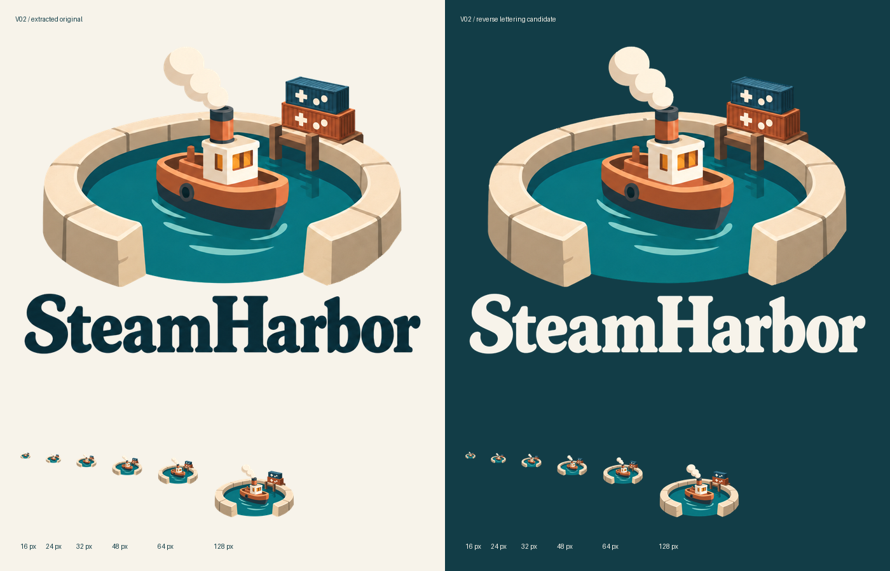

# V02-R01 — extração determinística e provas de aplicação

Estado: derivados técnicos da marca aprovada; composições novas e reduções são provas, não novas aprovações. A referência visual continua sendo o PNG imutável registrado no ADR-0006.

## Entrega

| Arquivo | Uso / estado |
|---|---|
| steamharbor-vertical.png | Assinatura principal extraída, RGBA; nome petróleo para fundo claro |
| steamharbor-symbol.png | Emblema isolado extraído da composição principal |
| steamharbor-wordmark.png | Lettering original isolado; não é fonte ou vetor |
| steamharbor-horizontal-candidate.png | Nova composição técnica feita dos mesmos recortes; prova de aplicação |
| steamharbor-vertical-reverse-candidate.png | Mesmo emblema, máscara do nome preenchida com marfim #F7F3EA; prova para fundo escuro |
| symbol-test-{tamanho}.png | Reduções reais de 16 a 512 px; testes, não favicons oficiais |
| extraction-review.png | Comparação clara/escura e reduções reais |
| edge-review.png | Ampliações de bordas sobre petróleo |
| manifest.json | Origem, coordenadas, dimensões, estados e SHA-256 |

## Método e reprodução

Executar `python tools/brand/extract_v02.py` a partir do repositório, com Python, Pillow, NumPy e SciPy. O script valida o SHA-256 da fonte antes de trabalhar. Dependências exatas da execução estão em `environment.json`.

O método delimita uma região do emblema em coordenadas da prancha, estima a cor do papel em uma faixa externa, segmenta o fundo e calcula cobertura nas bordas. Os pixels interiores opacos do emblema mantêm o RGB original. Só a faixa de contorno recebe cálculo de alpha e compensação do papel. A máscara do lettering é calculada separadamente, preservando suas formas; não há substituição tipográfica.

Não é possível recuperar matematicamente o alpha original de uma única imagem achatada. A borda é uma estimativa controlada, não uma extração pixel-exata de camadas inexistentes. Não foi usado preenchimento generativo, redesenho do barco ou geração de novos contêineres. O resultado da tentativa anterior com IA, que continha quadriculado pintado e alterações de forma, foi rejeitado e não integra este pacote.

As reduções usam Lanczos. A assinatura horizontal usa emblema limitado a 280×220 px, nome limitado a 480×100 px e intervalo de 28 px. Não se trata da miniatura horizontal da prancha: é uma nova composição dos elementos da referência principal. A versão reversa altera somente a cor do lettering, para legibilidade; por isso é identificada como candidata.

## Validação e limites

- Referência aprovada: hash preservado.
- Arquivos isolados: RGBA com alpha real, incluindo pixels transparentes e opacos.
- RGB sob alpha zero: limpo nos arquivos de extração.
- Bordas de vapor, água e contêineres: inspecionadas sobre fundo petróleo; removidos resíduos claros encontrados na primeira passagem.
- A prancha de revisão mostra o uso correto do nome escuro sobre claro e a candidata com nome claro sobre escuro.
- A 16–32 px, os símbolos de jogos e o lettering não são legíveis. Essas reduções não foram promovidas a favicon.
- 128 px preserva melhor a leitura geral do emblema, sem equivaler a validação de cada detalhe ou mínimo universal.
- Nenhuma implementação, merge, publicação, matriz vetorial, versão monocromática final ou favicon oficial é declarada nesta entrega.

A matriz vetorial fiel e o microícone exigem produção própria. Não inserir estes PNGs em um SVG e chamá-lo de vetor. Para uma futura simplificação, preservar a relação porto + vapor + jogos e registrar a nova prova separadamente. A instrução do proprietário para continuar sem pedir permissões operacionais autoriza a execução técnica; não muda retroativamente os arquivos que compõem a referência visual definitiva.
