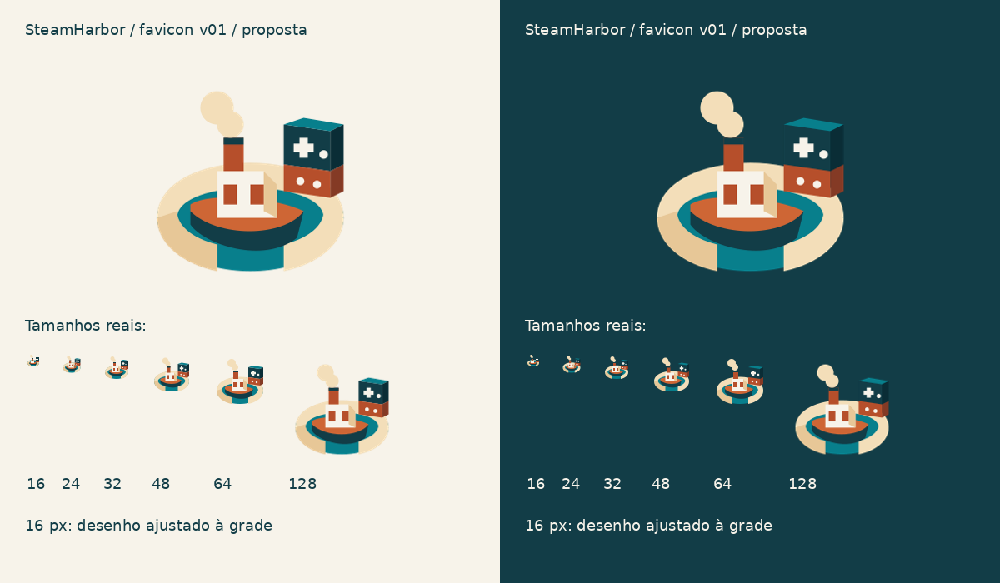

# Favicon v01 — proposta de microícone

**Estado: proposta visual, não aprovada.** Não substituir arquivos do aplicativo nesta etapa.

## Conceito

Redução específica do porto aprovado: cais aberto em marfim, água teal, barco cobre com vapor e dois contêineres com sinais de controle. Sem lettering, reflexos, textura, juntas de pedra ou perspectiva detalhada. O SVG foi desenhado para essa função; não é a vetorização da ilustração principal.

- `steamharbor-micro.svg`: matriz editável para 24 px ou mais. Inclui direcional e botões.
- `steamharbor-micro-16.svg`: ajuste óptico para 16 px. Reorganiza a grade e mantém apenas o direcional como referência a jogos.
- `favicon-{16,24,32,48,64,128,256}.png`: exports RGBA nos tamanhos indicados.
- `favicon-candidate.ico`: quadros exatos de 16, 32, 48 e 64 px; o quadro 16 usa a matriz óptica própria.
- `review.png`: apresentação ampliada e testes a 1× em claro/escuro.
- `manifest.json`: SHA-256 de cada arquivo.

## Leitura e limites

A redução mantém as massas do cais e do barco mais separadas que a redução direta da logo rica. Em 16 px, não se espera leitura dos contêineres como objetos detalhados; o conjunto funciona como sinal de reconhecimento. Em 24–32 px, o sinal gamer continua pequeno e requer avaliação visual do proprietário. A cruz isolada também pode lembrar um sinal médico; a presença do barco e da carga dá contexto, mas não elimina esse risco.

Usar exclusivamente em contextos pequenos caso aprovado. Para assinatura institucional e imagens grandes, continuar com os arquivos ricos aprovados em V02-R01. Não ampliar esta proposta para substituir a logo principal.

## Reprodução e validação

Executar `node tools/brand/render_favicon.cjs` com Sharp disponível e depois `python tools/brand/review_favicon.py` com Pillow. A prancha usa DejaVu Sans apenas nas legendas de revisão. Os SVGs não dependem de fonte, imagem embutida, script ou recurso externo.

Conferidos: dimensões PNG, alpha 0–255, quatro quadros do ICO e igualdade de cada quadro com o PNG correspondente. Revisão visual realizada na prancha clara/escura em tamanhos reais e ampliados. Não foi feita integração ou prova em navegadores reais. Esta entrega não inclui vetor fiel da logo completa ou matriz monocromática final.
