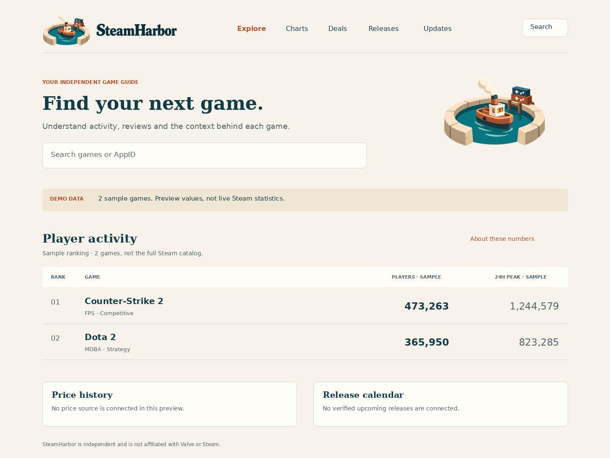

# Tema v01 — prova visual para desktop e mobile

Estado: proposta de aplicação da marca, sem aprovação visual específica ou implementação. A identidade ilustrada aprovada permanece a fonte de verdade; estas telas não substituem o design system automaticamente.

## Pranchas

- [Desktop claro](desktop-light.png) — marfim, petróleo e cobre.
- [Desktop escuro](desktop-dark.png) — petróleo, marfim e âmbar.
- [Mobile claro](mobile-light.png) e [mobile escuro](mobile-dark.png).

## Decisões propostas

| Área | Proposta | Motivo |
|---|---|---|
| Assinatura | Logo rica no cabeçalho; sem SH ou favicon provisório | Preservar o reconhecimento aprovado |
| Busca | Campo amplo antes da tabela | Atender consulta rápida como tarefa principal |
| Identidade | Marfim/petróleo nas superfícies; cobre/âmbar nos destaques | Transportar a marca sem textura sob os dados |
| Hierarquia | Títulos editoriais com serifa, interface sem serifa | Personalidade nos títulos e leitura previsível nos números |
| Desktop | Tabela aberta, números alinhados à direita | Comparação sem excesso de cartões |
| Mobile | Cada jogo com rótulos e duas métricas explícitas | Preservar comparação sem comprimir a tabela inteira |
| Disponibilidade | Mensagens de fonte não conectada | Evitar gráficos ou preços inventados |
| Ilustração | Emblema de apoio compacto no desktop, removido no mobile | Manter busca e informação próximas do topo |

As imagens reutilizam os binários da marca. A versão horizontal reversa foi derivada deterministicamente dos recortes íntegros; ver [V02-R02](../../production/v02-r02/README.md).

## Conteúdo e tipografia

Os dois jogos e os quatro números vêm de `src/fixtures/games.ts`: Counter-Strike 2 (473263 / 1244579) e Dota 2 (365950 / 823285). São fixtures de demonstração, não estatísticas atuais. A prancha informa isso de modo explícito. A interface continua em inglês, seguindo o produto atual.

DejaVu Serif/Sans são substitutas apenas na renderização destas provas. Não foram incorporadas ao aplicativo nem aprovadas como novas fontes de marca. A combinação de apoio Fraunces/Inter do guia ainda precisa de prova com os arquivos licenciados na implementação. O lettering da marca continua sendo o raster aprovado.

## Plano de implementação posterior

1. Rever a composição representativa e o comportamento mobile. Favicon v01 permanece uma proposta separada; a instrução para avançar de etapa não é registrada como aprovação retroativa do desenho.
2. Traduzir os papéis de cor em tokens semânticos e incorporar as fontes de apoio com licenças e versões.
3. Aplicar a direção ao shell, busca, tabela e página de jogo preservando contratos e fixtures.
4. Manter carregamento, resultados vazios, indisponibilidade, erro e cache com linguagem consistente.
5. Validar teclado, foco, contraste, zoom, 320 px, leitor de tela e movimento reduzido; testar busca e navegação reais. Só então relatar aceitação funcional.

## Limites da prova

São imagens estáticas de revisão, não screenshots de uma aplicação funcionando. Menu, busca e navegação são representações, não controles interativos. O menu mobile deverá conter Updates e as demais rotas na implementação. Não há novos recursos, gráficos históricos, busca conectada, preços ou lançamentos reais. O vetor fiel da logo completa e a matriz monocromática final seguem pendentes.

Reprodução: `python tools/brand/repair_reverse.py` e `python tools/brand/render_theme.py` (Pillow, NumPy, fontes DejaVu). Dimensões: desktop 1440×1080; mobile 390×1140. Manifesto registra os hashes. Revisão visual das quatro pranchas; não equivale a QA responsivo em navegador.
