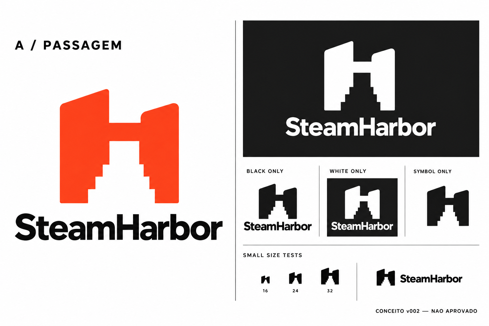
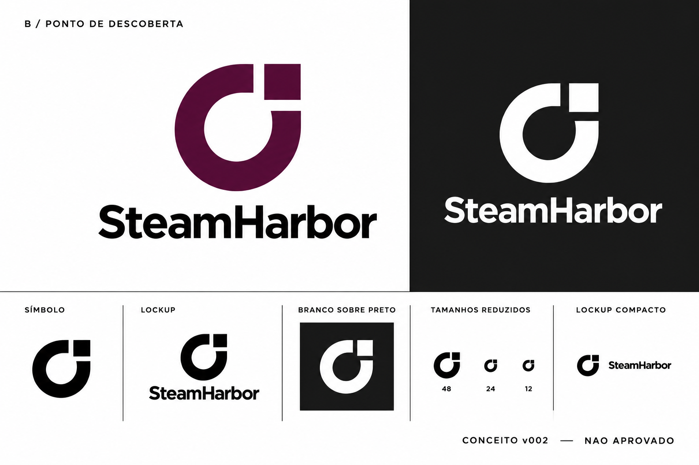
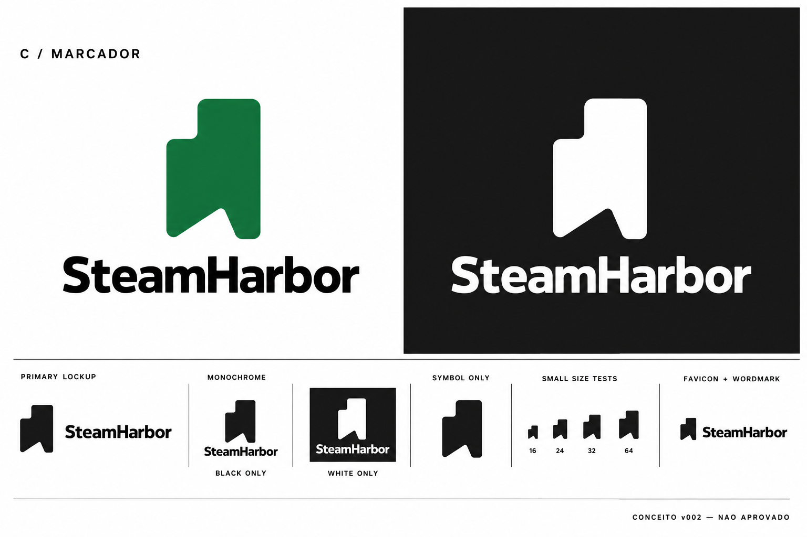

# Exploração A/B/C — v002

> Historical exploration: A/B/C were rejected. The definitive brand is [approved v02](../../approved/v02/steamharbor-v02-approved-board.png), governed by [ADR-0006](../../../decisions/ADR-0006-definitive-harbor-brand.md). This folder version is unrelated to the definitive v02.

**Propostas não aprovadas. PNGs conceituais gerados com ImageGen; não são vetores finais nem arquivos de produção.** Os binários exatos estão identificados no [manifesto](manifest.json).

As três pranchas mostram símbolo, composição com SteamHarbor, fundo claro e escuro, monocromia, composição compacta e redução ilustrativa. As etiquetas numéricas desenhadas nas imagens NÃO representam medições de pixels. Não usar essas pranchas como validação técnica de favicon ou tamanhos mínimos. A tipografia é desenho raster gerado; não corresponde a uma família identificada/licenciada.

## A — Passagem

Uma passagem em espaço negativo atravessa um H assimétrico. Relaciona Harbor a orientação e entrada em novos mundos; os degraus aproximam a forma da linguagem de jogos sem usar um controle. Tem massa sólida e leitura independente da cor. O nome é apresentado com peso firme e boa abertura das letras.

Riscos: leitura como castelo ou marca de estúdio; degraus podem se fundir em 16 px; topo inclinado pode sugerir movimento excessivo. Refinamento deve testar redução do número de degraus, equilíbrio dos pilares e proporção símbolo/nome, mostrando qualquer mudança antes de aprovação.

## B — Ponto de descoberta

Um quadrado destacado interrompe uma abertura circular: encontrar uma informação útil dentro de um catálogo amplo. Conecta descoberta e precisão. Curva e quadrado criam contraste estrutural; composição verbal mais neutra e tranquila.

Riscos: parecer analytics corporativo, indicador de carregamento ou letra G; categoria de símbolos circulares é concorrida. O vão precisa permanecer aberto em favicon e monocromia. É a direção mais analítica e a menos especificamente gamer.

## C — Marcador

Uma peça maciça, com degrau superior e recorte diagonal inferior, sugere lugar marcado no catálogo. A forma arredondada aproxima a marca do jogador e de um objeto colecionável. Tem poucos detalhes e uma silhueta simples para investigar em tamanhos pequenos.

Riscos: leitura como bookmark, bandeira, gráfico de barras ou ferramenta de produtividade; pode enfatizar coleção/watchlist, que ainda não está implementada. Não transformar o conceito em promessa de funcionalidade disponível.

## Recomendação

**A**, para refinamento, sem seleção automática. A passagem relaciona o nome ao ato de explorar; o H cria uma conexão nominal que B e C não têm; a geometria em degraus traz afinidade com jogos. Esses motivos sobrevivem à remoção da cor. Seu principal risco concreto é a perda dos degraus em favicon, que deve ser resolvida antes de aprovação final. C é a alternativa mais acolhedora; B favorece precisão abstrata.

## Verificação e próxima etapa

- Inspeção visual: nomes legíveis nas composições principais; variantes claras, escuras e monocromáticas visíveis; três silhuetas distintas.
- Limitações visíveis: leve textura raster e pequenas diferenças entre repetições. Não há equivalência pixel-exata entre variantes geradas. Não inferir cores oficiais por amostragem.
- v001 foi descartada como apresentação por glow e contraste ruim; v002 corrige a apresentação. Nenhuma delas foi aprovada. Slogans inventados na primeira geração foram removidos e não são propostas de voz.
- Após escolha: construir/refinar uma matriz única da direção escolhida, provar variantes a partir dela, testar favicon real a 16/24/32 px em 1× e 2×, nome compacto, proporções e monocromia. Registrar qualquer simplificação. Solicitar aprovação explícita da logomarca final antes de iniciar o sistema.
- Escolher direção não aprova o desenho final, a cor ou a tipografia. Merge documental também não aprova o desenho.
